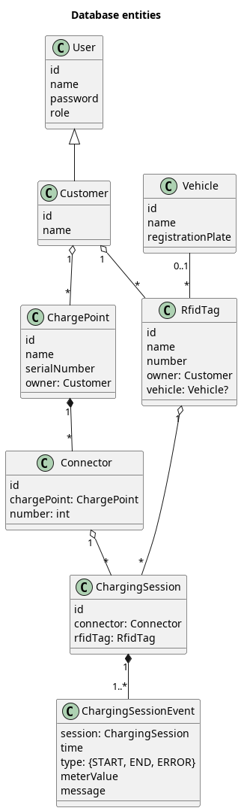

# Senior Spring Boot Coding Challenge for NetValue

This is a code sample for a coding challenge for NetValue Ltd.
To a senior Spring Boot developer position.

Original requirements are described in [PDF](docs/Spring%20Boot%20Coding%20Challenge.pdf).

This is Spring Boot application with REST API plus some documented ideas and interfaces.
The app is generated using [Spring Initializr](https://start.spring.io/#!type=gradle-project&language=kotlin&platformVersion=3.0.1&packaging=jar&jvmVersion=17&groupId=nz.netvalue&artifactId=codechallenge&name=codechallenge&description=Senior%20Spring%20Boot%20Coding%20Challenge%20for%20NetValue&packageName=nz.netvalue.codechallenge&dependencies=web,h2,security).

## Build

### Requirements

You need JDK 17 (LTS) to be installed on the build machine. 
On Ubuntu run `sudo apt install openjdk-17-jdk` to install it.

### Build

Define `JAVA_HOME` environment variable to point to correct installation of JDK 17, for example: `export JAVA_HOME=/usr/lib/jvm/java-1.17.0-openjdk-amd64`.
Run `./gradlew build` (or `gradlew.bat build` on Windows).
The resulting JAR file appears under the `build/libs` folder.

## REST API

### Authorization

This version of the app accepts JWT tokens only. But it has no methods to retrieve the token for simplicity.
It does not use Spring Security because Spring security looks like an over-engineering for the task to parse and verify JWT tokens.

Use [jwt.io](https://jwt.io/) to generate a token for payload like this:
```
{
  "sub": "${user name}",
  "exp": ${token expiration timestamp},
  "roles": ["${user role}"]
}
```

By default, the token uses HS256 sighing algorithm with "jwtsecretjwtsecretjwtsecretjwtsecret" secret.

### Public endpoints

#### GET /version

Returns application version and database schema version.

### Admin endpoints

#### GET /admin/charging-sessions

Returns the list of all charging sessions.

Query params: 
* `from` — date to select sessions from (inclusive)
* `till` — date to select sessions till (inclusive)

Result: list of JSON objects

#### POST /admin/charge-points/${charge point id}/connectors/

Adds a new connector to an existing charge point.

Body: empty

Result: JSON object of the new created charge point.

### Customer endpoints

#### POST /customer/charging-sessions/

Starts a charging session.

TBD

#### POST /customer/charging-sessions/${charging session id}/end

Ends the charging session.

TBD

## Entity model

The database entities are shortly described on a [PlantUML diagram](docs/entities.puml):



Charging session needs to persist the time and meter value both for session start and end.
Also, the session can be terminated by error (with error message).
So, the session timestamped events are stored into a separated table, there's no explicit session status.
To prefer inserts to updates.
To allow to add more event types in future without changing the DB schema.

## Date converter

A universal date converter is defined as a Kotlin extension function [here](src/main/kotlin/nz/netvalue/codechallenge/core/converter/DateConverter.kt).
The tests are [here](src/test/kotlin/nz/netvalue/codechallenge/core/converter/DateConverterTest.kt).

Because there is no timezone in the parsing string, it's parsed to `java.time.LocalDateTime`.
Customized `java.time.format.DateTimeFormatter` instances are used to parse datetime in the most lenient way.
However, different formatters for different field orders (yyyy-MM-dd, or dd.MM.yyyy, etc...) are used and are tried sequentially.
