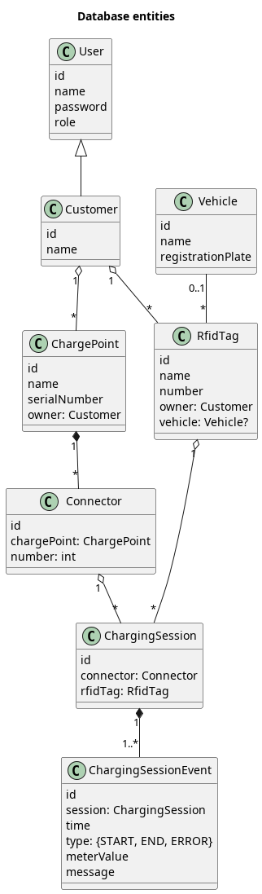

# Senior Spring Boot Coding Challenge for NetValue

This is a code sample for a coding challenge for NetValue Ltd.
To a senior Spring Boot developer position.

Original requirements are described in [PDF](docs/Spring%20Boot%20Coding%20Challenge.pdf).

This is Spring Boot application with REST API plus some documented ideas and interfaces.
The app is generated using [Spring Initializr](https://start.spring.io/#!type=gradle-project&language=kotlin&platformVersion=3.0.1&packaging=jar&jvmVersion=17&groupId=nz.netvalue&artifactId=codechallenge&name=codechallenge&description=Senior%20Spring%20Boot%20Coding%20Challenge%20for%20NetValue&packageName=nz.netvalue.codechallenge&dependencies=web,h2,security).

## Build

### Requirements

You need JDK 17 (LTS) to be installed on the build machine. 
On Ubuntu run `sudo apt install openjdk-17-jdk` to install it.

### Build

Define `JAVA_HOME` environment variable to point to correct installation of JDK 17, for example: `export JAVA_HOME=/usr/lib/jvm/java-1.17.0-openjdk-amd64`.
Run `./gradlew build` (or `gradlew.bat build` on Windows).
The resulting JAR file appears under the `build/libs` folder.

### Run

Run `java -jar build/libs/codechallenge-*[!plain].jar` (jar file which doesn't ends with `plain.jar`).
This is executable JAR. It starts HTTP server on port 8080.
The database is created as `data.*.db` files in the current directory by default.

## REST API

More detailed OpenAPI specification and Swagger UI are available when you run the app.
On http://localhost:8080 by default: http://localhost:8080/swagger-ui/index.html and http://localhost:8080/v3/api-docs.

### Authorization

This version of the app accepts JWT tokens only. But it has no methods to retrieve the token for simplicity.
It does not use Spring Security because Spring security looks like an over-engineering for the task to parse and verify JWT tokens.

Use [jwt.io](https://jwt.io/) to generate a token for payload like this:
```
{
  "sub": "${user name}",
  "exp": ${token expiration timestamp},
  "roles": ["${user role}"]
}
```

By default, the token uses HS256 sighing algorithm with "jwtsecretjwtsecretjwtsecretjwtsecret" secret.

### Public endpoints

No authentication is required here.

#### GET /version

Returns application version and database schema version.

### Admin endpoints

These endpoints are available only for tokens with role `ADMIN`.

#### GET /admin/charging-sessions

Returns the list of all charging sessions.

Query params: 
* `from` — date to select sessions from (inclusive)
* `till` — date to select sessions till (inclusive)

Result: list of JSON objects like this:
```json
{
  "timestamp": "2023-01-19T16:29:01.913270445Z",
  "status": 200,
  "result": [
    {
      "id": "test_session",
      "connector": {
        "id": "test_connector_1",
        "chargePoint": {
          "id": "test_charge_point",
          "name": "Test Charge Point",
          "serialNumber": "SOME SERIAL",
          "ownerId": "test_customer"
        },
        "number": 1
      },
      "rfidTag": {
        "id": "test_tag",
        "name": "Test Tag",
        "number": "NUMBER",
        "ownerId": "test_customer",
        "vehicleId": "test_vehicle"
      },
      "events": [
        {
          "time": "2023-01-16T15:42:00Z",
          "type": "START",
          "meterValue": 1234,
          "message": null
        },
        {
          "time": "2023-01-16T16:02:00Z",
          "type": "END",
          "meterValue": 2345,
          "message": null
        }
      ]
    }
  ]
}
```

#### POST /admin/charge-points/${charge point id}/connectors/

Adds a new connector to the existing charge point.
The next number for the new connector is automatically assigned.

Body: empty

Result: JSON object of the new created charge point connector.
For example:
```json
{
  "timestamp": "2023-01-20T16:56:58.523448700Z",
  "status": 200,
  "result": {
    "id": "474e00d8-5f14-4c36-9409-29525d364f3f",
    "chargePoint": {
      "id": "test_charge_point",
      "name": "Test Charge Point",
      "serialNumber": "SOME SERIAL",
      "ownerId": "test_customer"
    },
    "number": 3
  }
}
```

### Customer endpoints

These endpoints are available only for tokens with role `CUSTOMER`.

#### POST /customer/charging-sessions/

Starts a new charging session.
The API assumes the connector and RFID tag ids are mostly internal information for the system,
while charge point id and connector and RFID tag numbers are well-known,
so it's easier to use them to start session.

Body:
```
{
  "chargePointId": "${id of the charge point}",
  "connectorNumber": ${number of the connector on the charge point},
  "rfidTagNumber": "${unique number of RFID tag}",
  "meterValue": ${watts on the meter on the session start}
}
```

Result: JSON object with the new created session details.
For example:
```json
{
  "timestamp": "2023-01-21T16:00:33.936789366Z",
  "status": 200,
  "result": {
    "id": "bd168e05-0b6b-4bb5-ab66-fc7863e8555f",
    "connector": {
      "id": "test_connector_1",
      "chargePoint": {
        "id": "test_charge_point",
        "name": "Test Charge Point",
        "serialNumber": "SOME SERIAL",
        "ownerId": "test_customer"
      },
      "number": 1
    },
    "rfidTag": {
      "id": "test_tag",
      "name": "Test Tag",
      "number": "NUMBER",
      "ownerId": "test_customer",
      "vehicleId": "test_vehicle"
    },
    "events": [
      {
        "time": "2023-01-21T16:00:33.928431441Z",
        "type": "START",
        "meterValue": 123,
        "message": null
      }
    ]
  }
}
```

#### POST /customer/charging-sessions/${charging session id}/end

Ends the charging session.

Body:
```
{
  "meterValue": ${watts on the meter on the session end}
}
```

Result: JSON object with the updated session details.
For example:
```json
{
  "timestamp": "2023-01-21T16:00:33.936789366Z",
  "status": 200,
  "result": {
    "id": "bd168e05-0b6b-4bb5-ab66-fc7863e8555f",
    "connector": {
      "id": "test_connector_1",
      "chargePoint": {
        "id": "test_charge_point",
        "name": "Test Charge Point",
        "serialNumber": "SOME SERIAL",
        "ownerId": "test_customer"
      },
      "number": 1
    },
    "rfidTag": {
      "id": "test_tag",
      "name": "Test Tag",
      "number": "NUMBER",
      "ownerId": "test_customer",
      "vehicleId": "test_vehicle"
    },
    "events": [
      {
        "time": "2023-01-21T16:00:33.928431441Z",
        "type": "START",
        "meterValue": 123,
        "message": null
      },
      {
        "time": "2023-01-21T17:41:57.579363575Z",
        "type": "END",
        "meterValue": 456,
        "message": null
      }
    ]
  }
}
```

## Entity model

The database entities are shortly described on a [PlantUML diagram](docs/entities.puml):



Charging session needs to persist the time and meter value both for session start and end.
Also, the session can be terminated by error (with error message).
So, the session timestamped events are stored into a separated table, there's no explicit session status.
To prefer inserts to updates.
To allow to add more event types in future without changing the DB schema.

## Date converter

A universal date converter is defined as a Kotlin extension function [here](src/main/kotlin/nz/netvalue/codechallenge/web/converter/DateConverter.kt).
The tests are [here](src/test/kotlin/nz/netvalue/codechallenge/web/converter/DateConverterTest.kt).

Because there is no timezone in the parsing string, it's parsed to `java.time.LocalDateTime`.
Customized `java.time.format.DateTimeFormatter` instances are used to parse datetime in the most lenient way.
However, different formatters for different field orders (yyyy-MM-dd, or dd.MM.yyyy, etc...) are used and are tried sequentially.
